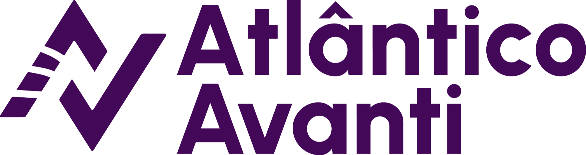

## 🤖**Atividades desenvolvidas durante o curso Bootcamp de Machine Learning- *Atlântico Avantii***

#### Repositório com intuito de postar as atividades desenvolvidas durante o bootcamp de Machine Learning do Avantii ministrado pelo Professor @Renê Ripardo

### ✅ Atividade_01: Diagnóstica. **Tema:** Conceitos básicos de machine learning.

- Conteúdo: Machine learning.
- Participantes: Individual.
- Avaliação do aluno.
